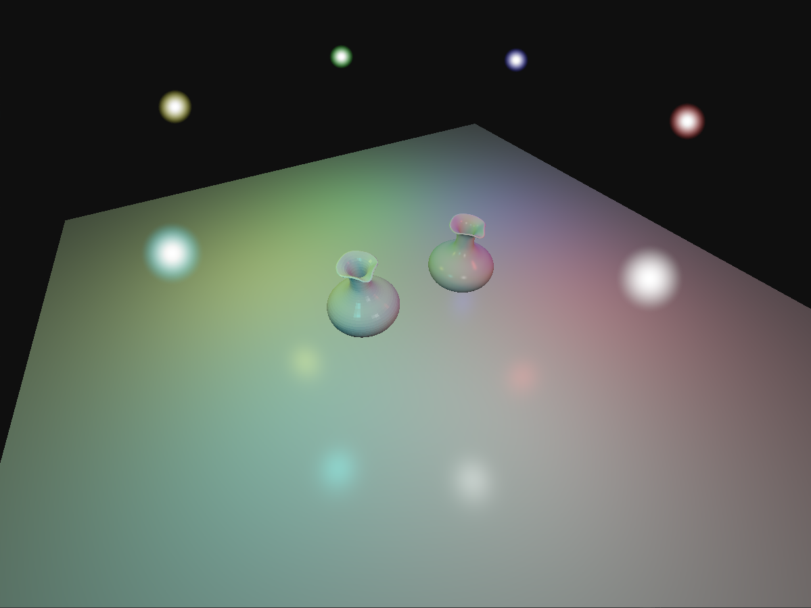

# axe-engine

A simple 3D engine based on [Brendan Galea's Vulkan Game Engine tutorials](https://www.youtube.com/watch?v=Y9U9IE0gVHA). Implemented using Vulkan for rendering and GLFW for windowing/input. Also uses GLM for math and tinyobj for loading .obj models.
The project currently consists of a scene with a quad and two vase models that are lit by moving point lights of different colors. The point lights are represented by semi-transparent billboarded sprites and the lighting system uses Blinn-Phong shading.

---

Camera movement:
* Arrow keys - Look up/down/left/right
* W	- Move forward
* S - Move backward
* A - Move left
* D - Move right
* Q - Move up
* E - Move down

---

The only prerequisite is downloading the Vulkan SDK with Debug libraries.

Build and run using the Visual Studio project.